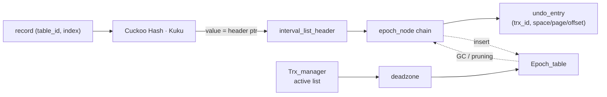

# AccelerateMVCC

> An in-memory acceleration index that speeds up MVCC version-chain lookups in disk-based DBMSs (InnoDB / MySQL).
> 디스크 기반 DBMS의 MVCC version-chain 탐색을 가속하는 인메모리 보조 인덱스.

[](LICENSE)


-orange.svg)

## Motivation

In HTAP workloads, a long-lived transaction forces InnoDB's MVCC to walk increasingly long version chains (undo-log chains), pulling many undo-log pages into the buffer pool. Profiling shows `row_search_mvcc` and related functions consuming **~45% of CPU** under such conditions — with I/O cost, buffer-pool pollution, and GC contention as the main symptoms.

**AccelerateMVCC** keeps only the *metadata* of each version (space / page / offset pointers) in a compact in-memory structure, so the correct visible version can be located quickly instead of traversing a long on-disk chain. The design adapts ideas from DIVA (VLDB '22) to an in-memory setting.

## Architecture



| Component | Role |
|---|---|
| Cuckoo Hash (Kuku) | record → version-chain header, O(1) |
| interval_list / epoch_node | epoch-bucketed chain of undo-entry metadata |
| Trx_manager | transaction ids + active-transaction snapshot (read view) |
| Epoch_table | epoch indexing + deadzone-based interval GC (Steam-style) |

## Status & Roadmap

Reviving a 2023 graduate project. Current plan:

- **A. Build revival** — make it compile & run again *(in progress)*
- **B. Prototype correctness** — wire up GC, fix bugs, add correctness tests
- **C. Experiments** — HTAP / long-transaction benchmarks vs. baseline
- **D. MySQL/InnoDB integration** — final goal

See [`docs/`](docs/) for the living status report, forensic findings, and the issue tracker.

## Repository layout

```
include/         core in-memory structure (hash, interval list, trx manager, epoch table)
Kuku/            Microsoft Kuku (cuckoo hashing) dependency
main.cpp         demo entry point
google_test.cpp  benchmarks / tests (GoogleTest)
docs/            status report, findings, progress log
```

## Building

C++17/20 + CMake. Build instructions are being reworked as part of build revival — see [`docs/README.md`](docs/README.md).

## Background

Started as a 2023 university graduation project by **Taeseong Ha (하태성)**; revived in 2026 as a solo personal project to finish it.

## Acknowledgements

Uses [Microsoft Kuku](https://github.com/microsoft/Kuku) for cuckoo hashing (MIT).

## License

[MIT](LICENSE)
