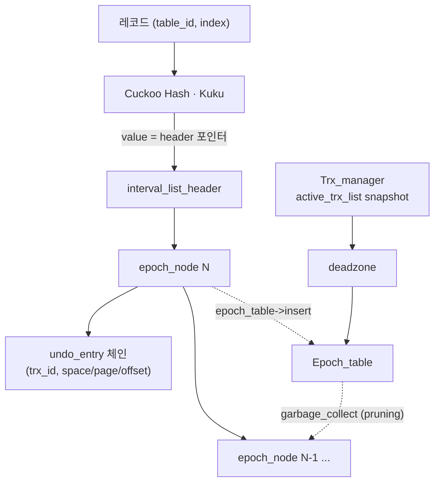

# AccelerateMVCC — 현황 & 로드맵

> 디스크 기반 DBMS(InnoDB/MySQL)의 MVCC를 가속하는 **인메모리 보조 인덱스**.
> 하태성의 2023년 졸업프로젝트를 **단독으로** 재개 (현재는 졸업용이 아닌 **개인 프로젝트**). 이 문서는 진행과 함께 갱신되는 **리빙 도큐먼트**입니다.

- 최종 수정: **2026-06-27** (세션 9 — Stage D + ⑤a-2 GC-on + 5-2b serve(C1·C2) + ⑥ GC-on 재측)
- 상세 포렌식·이슈 트래커 → [findings.md](findings.md)
- 세션별 진행 로그 → [progress-log.md](progress-log.md)

---

## 1. 문제 & 목표

**문제.** HTAP 워크로드에서 long-lived transaction이 존재하면 InnoDB의 version chain(undo log 체인)이 길어진다. 최신 가시 버전을 찾으려 긴 체인을 따라가며 다수의 undo log page를 buffer pool로 읽어야 하고, 이는 ① I/O 비용, ② buffer pool 오염, ③ GC와 long transaction의 경합을 유발한다. 졸프 프로파일링에서 long transaction 존재 시 `row_search_mvcc` 계열이 CPU의 **~45%** 를 차지함을 확인.

**접근.** 실제 데이터가 아니라 undo log의 **메타데이터(space_id, page_id, offset) 포인터**만 인메모리 구조에 보관하여, 올바른 버전의 위치를 빠르게 찾아주는 가속 인덱스를 만든다. DIVA(VLDB'22)의 아이디어를 인메모리로 변형.

**완성 기준(범위).**
- **1차 목표: A + B + C**
- **최종 목표: A + B + C + D**
- 전 과정을 문서/리포트(필요 시 도표·차트)로 정리.

---

## 2. 아키텍처

| 구성요소 | 파일 | 역할 |
|---|---|---|
| Cuckoo Hash (Kuku) | [accelerateMVCC.cpp](../include/accelerateMVCC.cpp) | 레코드(table_id, index) → `interval_list_header` 포인터 O(1) 매핑. Kuku item의 value 슬롯에 헤더 주소를 저장 |
| interval_list / epoch_node | [interval_list.h](../include/interval_list.h) | epoch(=trx_id/EPOCH_SIZE) 단위로 묶인 version chain. `undo_entry_node` = (trx_id, space/page/offset) |
| Trx_manager | [trxManager.h](../include/trxManager.h) | trx_id 발급, active transaction snapshot(read view) 제공 |
| Epoch_table | [epoch_table.h](../include/epoch_table.h) | epoch 인덱싱(lock-free 리스트) + deadzone pruning 기반 interval GC (Steam 스타일) |

상수: `EPOCH_SIZE=100`, `EPOCH_TABLE_SIZE=100`, `NUM_DEADZONE=50` ([common.h](../include/common.h), [epoch_table.h](../include/epoch_table.h)).

> **통합(Stage D)에서**: 위 코어가 mysqld 안에서 돈다. InnoDB undo가 off-latch **drainer**를 통해 캐시로
> 채워지고(populate), reader는 consistent-read 시점에 **consult**(GC-safe lineage walk)로 가시 버전을 찾아
> 캐시 레코드를 **서빙**한다. deadzone GC는 standalone Trx_manager가 아니라 **InnoDB의 active read-view**
> (pushed clock + leaf-domain registry)로 재구동된다 — 상세 [design-D5-gc.md](design-D5-gc.md).

---

## 3. 현재 상태 (2026-06-27 기준)

- **1차 목표 A+B+C ✅ · 최종 D ✅** — 실제 InnoDB 통합: populate → consult → authoritative serve → 성능 payoff.
- **⑤ purge-view GC(메모리 유계)**: **⑤a-2 ✅** — deadzone GC가 통합 mysqld에서 InnoDB read-view로 구동돼
  실제로 회수(정확·효율·race/UAF 0·메모리 유계). serve는 안전망(5-2b C1·C2) 위에서 GC와 함께 정확.
- **⑤b-lite ✅** — serve 깊은-읽기 repeat-scan latency를 메모이즈로 0.45s→0.22s(안전, back-edge chase는
  리뷰서 NO-GO로 폐기). **다음 = C3**(mode-1 serve-only 출하). 세션별 상세 [progress-log.md](progress-log.md),
  남은 작업 마스터 트래커 [open-items.md](open-items.md).

| 트랙 | 상태 |
|---|---|
| 코어 (A·B·동시성 1a~1c) | ✅ marked-pointer + per-traversal EBR + 전용 BG GC + FG cooperative unlink + tight-bound deadzone |
| Stage C 실험 (HTAP/long-txn) | ✅ 60s LLT 하 deadzone vs tail-only chain-CDF ([design-gc.md](design-gc.md) §11) |
| D-populate (쓰기) | ✅ off-latch drainer가 InnoDB undo를 캐시로 적재 (write tput = vanilla) |
| D-consult (읽기) | ✅ GC-safe lineage walk — 가시 버전 byte-정확 (construct_BAD=0) |
| D-serve (authoritative) | ✅ mode-2 verify-serve가 GC 위에서 정확 (49만 레코드 served, construct_BAD=0) |
| ⑥ 성능 payoff | ✅ held-reader deep read 64M 98s→0.45s (~190×), GC-on에서 생존 |
| ⑤ purge-view GC (메모리 유계) | ✅ ⑤a-2 통합 GC-on. ⑤b(0.16s 회복)·C3 남음 |

---

## 4. 로드맵

### A. 빌드 부활 ✅ (완료 2026-06-18)
- **DoD**: WSL2에서 `AccelerateMVCC` + `test_with_google` 컴파일 성공, 기존 테스트/벤치 실행 확인. → 달성(빌드·실행 OK, 안전 테스트 30/31 통과).
- 작업: WSL2 셋업 → CMake 손상 수정 → include 케이스 정리 → Kuku를 소스에서 빌드·링크 → build 산출물 `.gitignore` 처리.

### B. 프로토타입 완성·검증 ✅ (단일스레드 완료 2026-06-18)
- **DoD**: GC/deadzone 버그 수정, **insert/search/GC/deadzone 정확성 단위테스트** 통과(가시성 + deadzone pruning). → 달성: `correctness_test.cpp` 6개 통과 + ASAN 클린 + 기존 단일스레드 GC 테스트 통과.
- 완료: snapshot 보존(#7·#8), deadzone 초기화/가드(#4), GC sweep 메모리안전(#5·#6), `garbage_collect` 완료/return, list 방향 통일(Q1), `search` 최신 가시버전 반환.
- **추후(동시성/하드닝)**: 멀티스레드 GC reclamation, 빈 snapshot fast-path, dummy-list 누수. (deadzone 출처 = vDriver 재구현, findings 참조)

### C. 실험·결과 산출 ✅ (완료 2026-06-20)
- **DoD**: HTAP(OLTP+OLAP 병렬) / long-transaction 워크로드에서 baseline 대비 search 비용·GC 효과를 **수치 + 차트**로 제시. → 달성.
- 결과(상세 [design-gc.md](design-gc.md) §11): vDriver 하니스를 `stage_c_bench.cpp`로 이식(Zipfian writer + OLTP reader + 60s LLT + Guard-safe chain 샘플러). baseline = 프로토타입 내 tail-only GC 모드(InnoDB purge 모델). **60s LLT 하 deadzone hot-chain max 155 vs tail-only 845,977(~5,500×), read tput 1.36M/s vs 487/s(~2,800×)**, retire 22.4M vs 277. skew 0.8/1.2/1.6 전반 견고(~8,000×). FG cooperative unlink는 read-path +30%. 전 run LLT visibility OK + ASan/TSan clean. version-chain length CDF 차트 생성.

### D. MySQL/InnoDB 통합 ✅ (2026-06)
- **DoD**: 실제 InnoDB 소스에 가속 인덱스 연결, held-snapshot 깊은 읽기에서 vanilla 대비 효과 측정.
- 달성: populate(drainer) → consult(lineage walk, construct_BAD=0) → authoritative serve → **⑥ payoff**
  (held-reader deep read 64M 98s→0.16s[GC-off]/0.45s[GC-on], ~190~775×). 상세 [design-D.md](design-D.md)·
  [design-D4b-shadow.md](design-D4b-shadow.md).

### ⑤ purge-view GC + serve under GC (진행 중)
- **목표**: 캐시 메모리를 working-set으로 유계(GC) + 그 위에서 정확하게 서빙. 설계 [design-D5-gc.md](design-D5-gc.md).
- **⑤a-2 ✅**: deadzone GC를 InnoDB read-view(pushed clock + registry)로 구동 — 통합서 정확·효율·메모리 유계.
- **5-2b 진행**: serve under GC — C1(interior-over-prune 오라클) ✅ · C2(mode-2 verify-serve 정확) ✅ ·
  C3(mode-1 출하 hardening) 남음.
- **남은 것**: ⑤b(0.16s 회복, FG+BG 트랙) · 워크로드 폭(LOB·write-heavy+LLT) · 논문(한글+영문). 마스터
  트래커 [open-items.md](open-items.md).

---

## 5. 개발 환경

- **결정: WSL2 (Ubuntu).** C(sysbench/perf/MySQL)·D(InnoDB)가 사실상 리눅스 전용이고, 코어 코드는 표준 C++17/20이라 리눅스에서 그대로 빌드되므로 처음부터 리눅스로 토대를 잡는다.
- 현 상태: 이 PC에 WSL/MSVC/g++/cmake **미설치**. WSL 설치는 관리자 권한 + 재부팅 1회 필요(사용자 1회 실행).
- 빌드 레시피(WSL 준비 후 확정): `sudo apt install -y build-essential cmake git` → Kuku 빌드 → 프로젝트 빌드. A단계에서 CMake를 리눅스 친화적으로 정리하며 확정.

---

## 6. 문서 인덱스
- **README.md** (이 문서) — 개요·아키텍처·로드맵·상태 (위키 front page)
- **[NEXT-SESSION.md](NEXT-SESSION.md)** — 재개 가이드: 현재 위치·빌드/검증 레시피·로드맵 포인터
- **[open-items.md](open-items.md)** — 남은 작업 마스터 트래커(deferred·threats-to-validity·§0b 현황)
- **[progress-log.md](progress-log.md)** — 세션별 진행 로그(시간순 서사)
- **[REPORT.md](REPORT.md)** — A~C 통합 보고서(논문급) ⚠️ Stage C에 frozen, Stage-D Limitations 미반영(open-items)
- 설계 근거 — **[design-gc.md](design-gc.md)**(GC·동시성)·**[design-D.md](design-D.md)**(Stage D)·
  **[design-D4b-shadow.md](design-D4b-shadow.md)**(consult·serve)·**[design-D5-gc.md](design-D5-gc.md)**(⑤ purge-view GC·5-2b serve)·**[design-1c.md](design-1c.md)**
- **[findings.md](findings.md)** — 포렌식·이슈 트래커
- 원자료: Google Drive `AccelerateMVCC` 폴더 (졸프 문서, 미팅 영상, 논문 정리, 테스트 결과)
