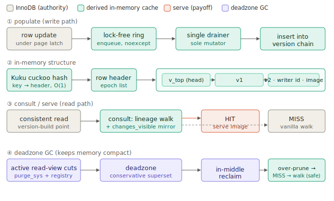
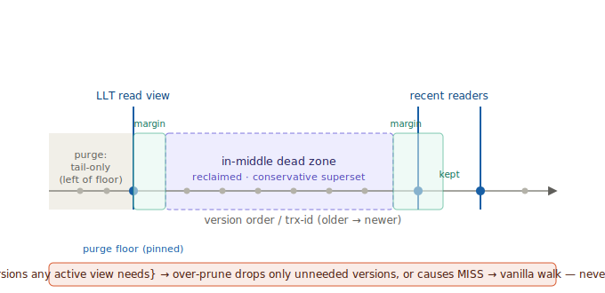
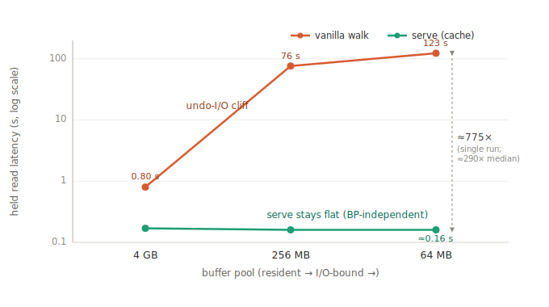
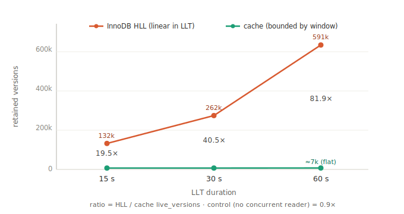
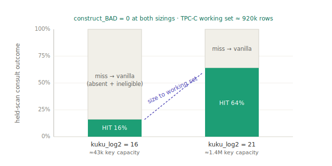

# AccelerateMVCC: Superset-Safe, Non-Authoritative In-Memory Serving of MVCC Version Reads in Disk-Based DBMSs

**Taeseong Ha (하태성)**

> Status: **draft (Phase 3, 2026-06-30).** This English version is the canonical text; a Korean reference
> version is kept separately in `paper-ko.md`. Not a submission, but written to review quality. Supporting
> data and reproduction scripts are in the repository under `integration/results/` and `integration/scripts/`;
> design rationale is in `docs/design-*.md`, and measurement detail in `docs/phase2-q3-llt.md` and
> `docs/phase3-tpcc.md`.

## Abstract

In hybrid transactional/analytical (HTAP) workloads, a single long-lived transaction (LLT) holds an old read
view that stalls InnoDB's purge, so MVCC version chains—the undo-log chains—grow unbounded for as long as the
LLT lives. An analytical read under that snapshot must walk these ever-longer chains, reconstructing each
visible version by replaying undo deltas and pulling many undo pages into the buffer pool. When the buffer pool
is small this produces an *undo-I/O cliff*: in our integrated setup a held deep read costs 0.8 s at a 4 GB
buffer pool but 123 s at 64 MB, with `row_search_mvcc` and related reconstruction accounting for ~45 % of CPU.

We present **AccelerateMVCC**, a derived, ephemeral, *non-authoritative* in-memory cache that keeps, per row,
the metadata and a small in-page image of each version, so that a reader's visible version can be located and—
crucially—**served** directly, skipping the on-disk undo walk that is the source of the cost. Because the cache
*serves* results rather than merely locating them, over-reclaiming a version is no longer a policy choice but a
correctness bug: the cache could serve a stale version that InnoDB would not. We rule this out structurally by
keeping the reclamation boundary a **conservative superset** of all active read views, which reduces every
over-reclamation to a cache miss that falls back to InnoDB's correct walk. We argue this *no-wrong-serve*
invariant semi-formally through four firewalls on the hit path.

Integrated into InnoDB 8.4.10, AccelerateMVCC flattens held-read latency across buffer-pool sizes (≈290× median
at 64 MB), keeps cache memory bounded by the live-transaction window rather than the dataset (its advantage over
InnoDB's History List Length growing linearly with LLT age: 19.5×/40.5×/81.9× at 15/30/60 s), and serves
byte-identical answers in every experiment (construct_BAD = 0), generalizing to composite and string keys,
secondary indexes, savepoints, crash recovery, and the standard TPC-C benchmark. We are equally explicit about
where the cache does *not* help—when base-table I/O, not undo reconstruction, is the bottleneck.

## 1. Introduction

### 1.1 The cost of MVCC reads under long-lived transactions

Multi-version concurrency control (MVCC) in a disk-based DBMS keeps a prior image of each updated row in an undo
log; a reader reconstructs the version visible to its read view by walking the undo chain backward from the
current record. Under ordinary OLTP, purge reclaims committed old versions promptly and chains stay short. HTAP
changes this. An analytical query runs as a long-lived transaction (LLT) that holds an old read view, and purge
can reclaim only versions older than the *oldest* active view. A single LLT therefore pins purge's floor, and
every version committed after it accumulates—the chains grow for as long as the LLT lives, observable as a
rising History List Length.

Reading deeply under that same snapshot is then expensive. For each row, InnoDB walks the now-long chain,
replaying undo deltas top-down to reconstruct the visible version. The cost is acute at small buffer pools,
where the undo pages needed for reconstruction are fetched from disk again and again—an *undo-I/O cliff*—and the
fetched pages pollute the buffer pool, dragging down concurrent OLTP. In our integrated setup, a held deep read
over a churned table costs about 0.8 s when a 4 GB buffer pool holds the working set, but about 123 s at 64 MB,
and reconstruction dominates CPU (~45 %).

Crucially, this cost is a property of the *storage form*, not of the algorithm. What a reader needs—which
version is visible, and its contents—is small, but it is scattered across the undo log as deltas, forcing
sequential reconstruction and page I/O on every read. If the reconstructed result could be materialized once and
held compactly in memory, both the reconstruction CPU (at large buffer pools) and the undo I/O and pollution (at
small ones) would vanish. This is our starting point.

### 1.2 This work's position and related work

This work shares its motivating problem—chain growth under LLTs—with a line of research from the same group, but
it does not extend or improve those systems; it is an **independently developed project**. Among the related
work, vDriver (SIGMOD '20) detects the *dead zone* between consecutive active read views—versions no active view
can see—and reclaims it from the middle of the chain, reaching exactly the region that purge, pinned by an LLT,
cannot. DIVA (VLDB '22) bounds chain length logarithmically with an interval tree. Our dead-zone detection is
**borrowed and adapted from vDriver** (introduced under the group's guidance), which we attribute explicitly;
the rest of the design—lock-free in-memory version-chain caching, the non-authoritative derived-served model,
and the superset-safety result below—is our own.

The essential difference from this related work is not improvement but **architectural position**. vDriver,
DIVA, and similar systems *own* the version store: they hold the authority to keep and supply versions, so a
somewhat-stale dead zone is merely a reclamation-policy choice and never breaks correctness—if the store has
dropped a version, that version simply does not exist. Our setting is different. We leave InnoDB's undo log
untouched and keep only a derived secondary index in memory; InnoDB remains the authority and our cache is a
non-authoritative copy. A cache that merely *located* the right version would be safe—a wrong hint just sends
the reader to InnoDB's walk—but we go further and **serve the reconstructed record directly, skipping the undo
walk**, which is the source of the performance gain. This introduces a new correctness tension: if the cache
over-reclaims, it can serve an older, wrong version for a row whose visible version InnoDB still holds. In other
words, *the moment a derived cache serves results, over-reclamation stops being a policy question and becomes a
wrong-answer question.* The "stale dead zone is harmless" assumption of the owned-store designs does not hold
here; resolving this tension is the subject of §1.3.

### 1.3 Approach: a superset-safe, derived-served cache

AccelerateMVCC keeps, for each row (clustered primary key), the metadata of its versions (undo locator, writer
transaction id) and a small in-page image of the row, in a compact lock-free in-memory version chain. At a
reader's version-build point, the cache walks that row's lineage to the first version visible to the reader's
snapshot and, if the version is eligible, **serves its byte image, skipping the undo walk**. To keep memory
compact, it builds a dead zone from the active read views and reclaims versions in the middle of the chain
(adapting vDriver's pattern to an in-memory, serving setting).

The key idea resolves the §1.2 tension *structurally*. If the dead zone is kept a **conservative superset** of
the active read views—if any version that *might* be needed by some active view is never put in the reclamation
set—then wrong serves from over-reclamation are excluded by construction. Even aggressive reclamation can only
(i) drop a version no active view needs, or (ii) sever a lineage link in the cache, in which case consult returns
a miss and the call site falls back to InnoDB's correct walk. Every cache failure—reclamation, drop, capacity
overflow, hash collision—thus converges to a "slow correct answer," and a wrong answer is simply not in the
result space. We decompose this *no-wrong-serve* invariant into four firewalls that jointly form the necessary
condition for a hit—full-PK identity, a visibility mirror, lineage contiguity, and image fidelity—and argue it
semi-formally (§3).

This is what sets the work apart from the related systems: a **superset-safety result specific to a
non-authoritative, derived-served cache that does not own the version store**, which is what licenses safe
middle-of-chain reclamation without a hot mutex.

### 1.4 Contributions

- **A derived-served MVCC cache model and a no-wrong-serve invariant.** With InnoDB as the authority, a derived
  in-memory cache serves reconstructed results directly yet provably never serves the wrong version—guaranteed
  structurally by a conservative-superset design invariant and four firewalls (§3).
- **A real integration into InnoDB 8.4.10.** A leaf-domain, one-way (InnoDB→cache) integration—noexcept
  lock-free ring enqueue under the page latch, a single off-latch drainer as the sole mutator, consult at the
  consistent-read version-build point, and an authoritative walk-skipping serve—adds negligible cost to the
  transaction hot path (§4).
- **A multi-run, error-bar evaluation.** Held-read latency flattens across buffer-pool sizes (≈290× median at
  64 MB); cache memory stays bounded by the live-transaction window (advantage linear in LLT age); effective
  speedup and concurrent-HTAP behavior are measured on real mysqld; and every served answer is byte-identical to
  the vanilla walk (construct_BAD = 0 throughout) (§5).
- **An honest scope and regime characterization on standard TPC-C.** On a standard HTAP benchmark we show
  serving correctness, a capacity-based coverage-sizing law (hit rate 16 %→64 %), and the regime boundary where
  the cache helps—large gains when undo I/O is the bottleneck, modest gains on base-I/O-bound large-table scans
  (§5.5).

### 1.5 Results in brief

Integrated into InnoDB 8.4.10, AccelerateMVCC removes the undo-I/O cliff of held analytical reads, improving
latency by about 290× (median) over the vanilla walk at a 64 MB buffer pool. About one run in four degrades to
the correct vanilla walk when GC reclaims navigation versions in real time under a small buffer pool—still
correct, performance-only. Cache memory stays bounded over the LLT's lifetime, so its advantage over InnoDB's
History List Length grows linearly with LLT age (19.5×/40.5×/81.9× at 15/30/60 s). Every served answer is
byte-identical to the vanilla walk (construct_BAD = 0), and this holds for composite and string keys,
secondary-index reads, savepoint rollback, crash recovery, and the standard TPC-C benchmark. We are equally
explicit about the precise conditions under which the cache helps—when undo reconstruction, not base-table I/O,
is the bottleneck.

## 2. Background and Motivation

### 2.1 InnoDB MVCC and version reconstruction

InnoDB updates a clustered-index record in place, but first writes the pre-update image to the undo log and sets
the record's roll_ptr to point at that undo record. Repeated updates of the same row form a chain of undo records
linked by roll_ptr, with the most recent update at the head (the current record) and older versions below it.

A reader fixes its read view once, at start. The view is summarized by four values: up_limit_id (every smaller
transaction id is visible), low_limit_id (every id at least this large is invisible), creator_trx_id (the reader
itself), and the sorted set m_ids of transaction ids that were still active in between. Whether a version is
visible to the view is decided by applying changes_visible to the id that created it: (i) visible if the id is
below up_limit or equals the creator; (ii) invisible if the id is at least low_limit; (iii) visible if m_ids is
empty and the id falls in between; (iv) otherwise decided by binary search in m_ids. For a given row, the version
visible to the view is the first one—descending from the head—for which changes_visible holds, and it is unique.

The cost lies in *reconstructing* that version. An undo record is a delta (only the changed columns), not a full
image, so InnoDB starts at the head and walks roll_ptr downward, applying each undo delta in turn to recover the
older image (trx_undo_prev_version_build). Reconstructing a visible version at depth d thus reads and applies d
undo records.

### 2.2 Purge and long-lived transactions

A committed old version is reclaimed by purge once no active read view can see it. But purge can reclaim only what
is older than the *oldest* active view. When an HTAP analytical query runs as a long-lived transaction (LLT)
holding an old view, purge's reclamation floor is pinned at that LLT, and versions committed after it pile up
unreclaimed. The chain grows monotonically for the LLT's lifetime, observable as InnoDB's History List Length (the
count of unreclaimed versions).

### 2.3 The undo-I/O cliff (motivation)

With chains long, a deep analytical read under the LLT's snapshot triggers the sequential reconstruction of §2.1
over the full length of each row's chain. This cost is sensitive to the buffer-pool size. In our integrated setup,
after applying write-heavy churn to a 1,000-row table, a held snapshot reading the whole table deeply costs about
0.8 s at a 4 GB buffer pool (table and undo resident) but about 123 s at 64 MB (undo pages fetched from disk
repeatedly)—a cliff of more than 150×. Under this condition row_search_mvcc and the reconstruction path take ~45 %
of CPU, and the fetched undo pages pollute the buffer pool, lowering concurrent OLTP throughput as well.

The key observation, again, is that the cost comes from the *storage form*, not the algorithm. The information a
reader needs is small, but its delta encoding in the on-disk undo log forces reconstruction and page I/O on every
read. Materialize the reconstructed result once and hold it compactly, and a large buffer pool saves the
reconstruction CPU while a small one is spared the undo I/O and pollution.

### 2.4 The borrowed building block: vDriver's dead zone (attributed)

Keeping the in-memory cache compact requires reclaiming versions that are no longer needed—but in exactly the
situation where an LLT stalls purge, tail-only reclamation (oldest first) is powerless. vDriver (SIGMOD '20)
detects the *dead zone*—the versions between two consecutive active read views that no active view needs—and
reclaims them from the middle of the chain. We **borrow and adapt** this dead-zone detection for the cache's
reclamation (the part introduced under the group's guidance, which we attribute). As noted in §1.2, however,
vDriver owns its version store, so a somewhat-stale dead zone is harmless, whereas we *serve*
non-authoritatively, so reusing the same reclamation as is could produce a wrong serve. Closing that gap is the
superset-safety result of §3.4.

## 3. Design

### 3.1 Overview: data structures and flow

> **Figure 1.** AccelerateMVCC's four stages between InnoDB (the authority) and the derived cache: ① populate
> (latch-bound ring enqueue → single drainer → chain insert), ② the in-memory structure (cuckoo hash → header
> → epoch interval-list of version nodes), ③ consult/serve (lineage walk → hit serves the image, miss walks
> vanilla), and ④ dead-zone GC (read-view cuts → conservative-superset dead zone → in-middle reclaim, where
> over-prune degrades only to a safe miss→walk).

AccelerateMVCC is an in-memory secondary index keyed by (table_id, clustered primary key). The mapping from a key
to its version-chain header is an O(1) cuckoo hash (Microsoft Kuku). Each header points at an epoch-bucketed
*interval list* of that row's versions. Each version node holds the writer transaction id that created it, the id
of the immediately preceding version (version_trx-id), undo-locator metadata, and a small in-page image of the
row—a verbatim copy of the full physical record, in-page and below a size cap.

The runtime flow has four stages. **Populate**: the undo record InnoDB produces on an update is loaded into the
cache. **Consult**: at a reader's version-build point, the cache is queried for the visible version. **Serve**: on
a hit, the cache's image replaces InnoDB's walk. **GC**: dead-zone reclamation keeps the cache compact. (The
integration points are §4.)

### 3.2 The lineage walk: choosing the visible version

Consult *mirrors* InnoDB's roll_ptr walk in memory. It finds the row's header by full primary key, starts at the
live-top writer (the transaction id of the already-latched current record), and follows the version nodes'
writer→predecessor links downward. A link holds when one version's version_trx-id equals the writer id of the
version before it—an id-equality isomorphic to roll_ptr adjacency in the vanilla chain. At each node it applies
the changes_visible predicate (a byte-exact replica of the four branches of §2.1) and chooses the first version
that is visible, descending from the head. The read-view inputs to that predicate (up/low/creator/m_ids) are
mirrored verbatim from the values InnoDB holds for that reader.

If the walk is broken (a missing intermediate link) or ambiguous (one writer with two distinct predecessors—a
cross-generation clash from delete+reinsert, say), consult stops there and returns a miss. The version it chooses
is therefore always on the very lineage the vanilla walk would traverse, never one from a different generation or
a severed chain.

### 3.3 Dead-zone GC: bounding memory by the live-transaction window

To keep the cache compact, it forms a dead zone from the boundaries (cuts) of the active read views and reclaims
the version nodes in that zone. The dead zone is assembled from two sources: (A) a free read of InnoDB's purge_sys
view gives a safe floor, and (B) by piggybacking on the trx_sys mutex InnoDB already holds when it opens a read
view, the view's boundary is mirrored into our leaf-domain lock-free registry (no new lock). From these cuts the
dead zone is built and reclaimed with an amortized windowed sweep.

This reclamation clears the *in-middle gap* between the LLT and the recent readers—the region above the floor the
LLT pins, which no active view needs and which purge cannot touch. As a result, the number of versions the cache
retains is proportional to the *active-transaction window* and independent of the dataset size (measured in §5.3).

### 3.4 The superset-safety result (the central novelty)

> **Figure 2.** The dead zone reclaimed in the middle of the chain is kept a conservative superset of the
> active read views—the keep set ⊇ every version any active view needs, with a safety margin around each view.
> Over-pruning can therefore only drop a version no view needs, or sever a link into a miss → vanilla walk—
> never a wrong serve. Purge, pinned at the LLT's floor, cannot reach this in-middle zone.

The tension of §1.2 and §2.4—that a derived cache, because it serves, turns over-reclamation into a wrong
serve—is excluded *structurally*. The idea is to keep the dead zone a **conservative superset** of the active read
views: any version that *might* be needed by some active view is never placed in the reclamation set (the boundary
is always over-approximated on the safe side).

Under this invariant, for a single version V and a single read view, reclamation has only two outcomes. (i) If V
is needed by no active view, reclaiming it is harmless. (ii) If V is needed by some active view, then by the
superset definition V is never in the reclamation set at all. The dangerous third case—"reclaim a needed V"—arises
only under under-approximation, which the superset invariant rules out. So even when reclamation severs a lineage
link in the cache, it has either dropped a version that reader did not need, or left a miss at the severed point
that sends consult to the vanilla walk. Neither is a wrong serve. That is: **under the superset invariant, every
over-reclamation is performance-only (miss→walk), and there is no path by which reclamation breaks correctness.**

This result is the work's central contribution. Owned-store designs like vDriver and DIVA need no such result,
because for them a stale dead zone is harmless; a non-authoritative, serving, derived cache needs the superset for
correctness, since for it over-pruning *is* a wrong serve. And because the superset is maintained without any new
lock (via the A+B sources of §3.3), it licenses safe middle-of-chain reclamation without a hot mutex.

### 3.5 The no-wrong-serve invariant: four firewalls

If §3.4 secures reclamation, the safety of the whole serving path is secured by four firewalls that jointly form
the necessary condition for a hit. Consult issues a hit only if all of the following hold; if any fails it returns
a miss and the call site walks vanilla.

- **F1 (full-PK identity).** The cuckoo hash is a bucket hint, not authority. A candidate node must match the
  reader's full primary-key bytes by memcmp (enforced in production) to be considered. → No other row can slip in
  through a cuckoo collision.
- **F2 (visibility mirror).** A candidate's visibility is decided by a byte-exact replica of InnoDB's four-branch
  changes_visible. The premise of branch (iv)—m_ids sorted ascending—is checked at consult entry and, if violated,
  returns a miss (fail-closed). → The version the cache deems visible equals the version InnoDB's rule deems
  visible.
- **F3 (lineage contiguity).** A hit requires that the cache's gap-free run reaches the live top (contiguity) and
  that the §3.2 lineage walk is unbroken. A severed link (a ring drop) or an ambiguous one (a cross-generation
  clash) is a miss. → The chosen version is on the lineage the vanilla walk traverses, not a severed or
  different-generation one.
- **F4 (image fidelity).** The served bytes are a verbatim copy of the full physical record captured under the
  leaf X-latch at write time. We verified beforehand that parsing the cache's full record with InnoDB's parser
  yields the same data, delete flag, and offsets as the vanilla reconstruction. Rows with an off-page LOB, a
  virtual column, or a size over the cap are captured with img_len = 0 and miss as ineligible. → The served record
  is a byte-identical substitute for the vanilla reconstruction, and no partial or truncated image is ever served.

A hit for which all four hold, combined with the lineage uniqueness of §3.2, implies "the bytes served = the bytes
the vanilla walk would have produced," while every non-hit (any of the four broken) goes to the vanilla walk,
which is correct. The serve result is therefore one of {a hit that is provably correct, a miss that is
vanilla-correct}, and **a wrong row is unreachable in the result space.** The argument is a semi-formal,
code-grounded hand argument (machine checking is future work, §7); it is also supported empirically by the mode-2
verify-serve of the evaluation, which compares every served record against the vanilla walk byte-for-byte
(construct_BAD = 0 throughout).

### 3.6 Concurrency model

The hot path (reads and inserts) is lock-free. Unlink consistency is maintained with marked pointers (Harris), and
safe memory reclamation with per-traversal epoch-based reclamation (EBR). Because a single off-latch drainer is
the only mutator of the index (the single-producer invariant), the versions of a row accumulate at the head in
the commit order the latch serialized, append-only; and GC runs on a separate leaf-domain thread that does not
touch the head epoch, so it is disjoint from the drainer's appends.

Serve's memory safety rests on the EBR guard, taken before consult's first dereference and spanning through the
copy of the image into the caller's buffer: because reclamation stamps a higher epoch only after unlinking, a
guard-protected traversal never reaches a freed node, and the served record is copied into the caller's buffer so
no raw pointer escapes the facade. The mode-1 (serve-only) ship path, which has no self-verification because it
skips the walk, adds a gc_generation second firewall (catching a reclaim-vs-probe race) and a 1-in-N walk-audit on
top of the structural firewalls of §3.5.

## 4. Implementation

### 4.1 Integration points in InnoDB

AccelerateMVCC is statically linked into InnoDB 8.4.10, with hooks at three points. **Populate** sends a record's
metadata and row image to the cache where an update writes its undo record (the undo report in trx0rec.cc).
**Consult** queries the cache where a consistent read reconstructs the visible version
(row_vers_build_for_consistent_read in row0vers.cc). **GC** reads trx_sys's read-view information to drive the
dead zone. The integration carries a single InnoDB→cache edge (the cache never modifies InnoDB state) and stays in
a leaf domain.

### 4.2 Latch-bound enqueue and an off-latch single-consumer drainer

The populate hook runs under a page X-latch, so touching the cache's data structures there directly would risk
malloc, blocking, and thread-unsafety under the latch. Instead the hook only **enqueues** the record (scalar
metadata plus the below-cap image) into a lock-free MPMC ring—noexcept, allocation-free, non-blocking—and drops
the item if the ring is full (that key then misses in consult and walks vanilla). The actual insertion into the
index is done by a single off-latch **drainer** thread, the sole mutator of the index (the single-producer
invariant). Versions of a row therefore accumulate at the head in the commit order the latch serialized,
append-only.

### 4.3 Serve modes and toggles

Serving has three modes, selected by environment variable. **Mode 0 (shadow, default):** consult runs but does
not serve (normal behavior unchanged). **Mode 2 (verify-serve):** on each hit it performs the vanilla walk,
compares bytes, and substitutes the cache record only on a match—re-verifying every serve at runtime, which we use
as a correctness gate. **Mode 1 (serve-only, the ship performance path):** it skips the walk and returns the cache
record. Mode 1 has no self-check, so beyond the structural firewalls of §3.5 it is backed by a gc_generation
second firewall and a 1-in-N walk-audit (sampling against the vanilla walk and tripping on a mismatch). The
dead-zone GC, the drain cap (the ⑥ stabilizer), the image cap, and the cuckoo capacity (kuku_log2) are likewise
environment-tunable.

### 4.4 Vendoring

For repository-standalone reproduction, the five modified upstream InnoDB files (the consistent-read point, the
undo report, the view-open path, lifecycle, and so on) are vendored as integration/innodb/innodb-8.4.10-accel.diff,
together with all accelerator sources under integration/innodb/ and include/. The build compiles and links the
accelerator sources into innobase, and the measurement scripts are in integration/scripts/.

## 5. Evaluation

### 5.1 Setup and methodology

The evaluation runs on a mysqld with AccelerateMVCC integrated into MySQL 8.4.10 (gcc-13). The central metric is
**held-snapshot analytical-read latency**—the cost of a snapshot-holding analytical read retracing deepened chains
over write-heavy OLTP churn—because throughput-only metrics carry little signal in a short, in-memory window. The
universal correctness gate across all experiments is **construct_BAD = 0** (the answer served under mode-2
verify-serve is byte-identical to the vanilla walk). Headline configurations are re-measured N times and reported
as median with min/max and a degrade rate, not as a single run; raw logs and CSVs are archived under
integration/results/.

### 5.2 The ⑥ held-read serve payoff (headline)

We compare a held analytical read under the vanilla walk (mode 0) and under serve (mode 1, GC on with a drain
cap). With churn paused before measurement (N = 16):

> **Figure 3.** As the buffer pool shrinks (4 GB → 256 MB → 64 MB), the vanilla walk climbs an undo-I/O cliff
> (0.8 s → 76 s → 123 s) while serve stays flat near 0.16 s, independent of buffer-pool size—≈290× at 64 MB.
> (The curve is the single-run BP sweep that isolates the mechanism; the table below gives the multi-run
> medians, N = 16, for the 4 GB and 64 MB end points.)

| Buffer pool | Vanilla walk (median) | Serve (median) | Speedup | Degrade |
|---|---|---|---|---|
| 64 MB (I/O-bound) | 132.1 s | 0.454 s | **≈290×** | 2/8 |
| 4 GB (resident) | 1.106 s | 0.462 s | ≈2.4× | 0 |

At 64 MB serve is about 290× (median) faster than the vanilla walk; the mechanism is the elimination of undo I/O
(physical reads drop from ≈1.4 M under vanilla to ≈4 k under serve). In 2 of the 8 serve runs, however, GC
reclaiming a navigation version in real time severs the chain and latency degrades to 87–121 s—but consult then
returns a miss and falls back to the correct vanilla walk, so **construct_BAD = 0 holds**; this is a
performance-only event, and the drain cap stabilizes the degrade rate to ≈1/4. At 4 GB (resident) there is no undo
I/O, so only the reconstruction CPU is saved and the gain is a smaller ≈2.4×. In the concurrent-HTAP regime
(reading while churn runs—the literal DoD configuration, N = 17) serve is ≈18× (median), and **mode-2 verify-serve
stays construct_BAD = 0 even under concurrent GC reclamation** (≈9,000 served, all byte-identical); the higher
absolute latency than in the churn-paused case is the contention of the churn threads on base-table pages in a
small buffer pool.

### 5.3 The ⑤ memory bound

Under an LLT plus concurrent HTAP readers, we compare the number of versions the cache retains (live_versions)
with InnoDB's History List Length (HLL) (realistic full table, N = 5):

| LLT | InnoDB HLL | Cache live_versions | Ratio |
|---|---|---|---|
| 0 readers (control, no gap) | ≈700 k | ≈750 k | **0.9×** |
| 15 s | ≈123–142 k | ≈6.8–7.0 k | **19.5×** |
| 30 s | ≈238–286 k | ≈6.9–7.2 k | **40.5×** |
| 60 s | ≈571–611 k | ≈7.0–7.2 k | **81.9×** |

> **Figure 4.** InnoDB's History List Length grows linearly with the LLT, while the cache's retained versions
> stay bounded near 7,000, so the ratio grows linearly with LLT age (19.5×/40.5×/81.9× at 15/30/60 s). With no
> concurrent reader—and therefore no in-middle gap—the control is 0.9×.

The cache's live_versions stays bounded at ≈7 k regardless of LLT duration, while InnoDB's HLL grows linearly with
the LLT, so the ratio grows linearly with LLT age (consistent across all 15 runs). The 0-reader control is 0.9×:
with no in-middle gap the cache tracks InnoDB—the advantage comes entirely from the gap that concurrent read-view
readers create (§3.3). This demonstrates, in integration, the ⑤ property that memory is proportional to the
live-transaction window and independent of the dataset.

### 5.4 Effective speedup

We measure whether the cache's actual target—a held analytical reader—helps even under write-heavy churn with the
delete/insert (miss-inducing) pattern (GC off, N = 3):

| Buffer pool | Vanilla (median) | Serve (median) | Speedup | Held-reader hit |
|---|---|---|---|---|
| 4 GB | 0.283 s | 0.097 s | ≈2.9× | 99.3–99.8 % |
| 256 MB | 0.264 s | 0.095 s | ≈2.8× | 99.5–99.9 % |
| 64 MB | 4.25 s | 0.147 s | **≈29×** | 99.5–99.8 % |

The held analytical reader hits ≥ 99.5 % even under delete+reinsert churn, because its consistent snapshot
predates the churn and so needs only the original versions, which are cached (the previously reported "22 % miss"
was the short readers near the chain head—a population the cache does not target). At the I/O-bound 64 MB, undo
reads drop from 25–33 k to ≈450, for ≈29×.

### 5.5 Standard benchmark: TPC-C

We measure a held STOCK analytical read over the real TPC-C transaction mix of a standard HTAP benchmark
(sysbench-tpcc, scale 2, ≈920 k rows). **Correctness** holds on the standard dataset too: under mode-2
verify-serve, 160,713 served records are byte-identical, construct_BAD = 0 (all composite keys generalized).

**Coverage is capacity-bounded.** TPC-C's working set (≈920 k) far exceeds the default cuckoo capacity (kuku_log2
= 16, ≈43 k keys), so the held-scan hit rate is only ≈16 %; sizing capacity to the working set (kuku_log2 = 21,
≈1.4 M) raises it to 64 %—showing the capacity bound of §7 (design-D8) acting as a sizing knob on a standard
benchmark (construct_BAD = 0 at either sizing). TPC-C's customer.c_data (≈400 chars, off-page) is handled as
ineligible by the in-page scope of §3.5/F4 and §7.

> **Figure 5.** Sizing the cuckoo capacity from kuku_log2 = 16 to 21 (to fit the ≈920 k working set) raises the
> held-scan hit rate from 16 % to 64 %—the capacity bound of §7 acting as a sizing knob—while construct_BAD
> stays 0 at both sizings. The remaining misses (off-page customer, plus rows beyond capacity) fall back to the
> vanilla walk.

**The latency speedup is modest** (kuku_log2 = 21, ≈64 % hit, N = 3):

| Buffer pool | Vanilla (median) | Serve (median) | Speedup | Physical reads (m0/m1) |
|---|---|---|---|---|
| 4 GB | 0.322 s | 0.253 s | ≈1.3× | ≈4.3 k / ≈4.4 k |
| 64 MB | 1.272 s | 0.899 s | **≈1.4×** | ≈248 k / ≈245 k |

Unlike sbtest's ≈29×–290× (§5.2, §5.4), the gain is only ≈1.4×, and the physical-reads column shows directly why:
at 64 MB mode-0 and mode-1 read about the same (≈245 k), because a large TPC-C table (stock's 200 k rows ≫ 64 MB)
is dominated by **base-table page I/O**, so even though serve eliminates undo reconstruction (CPU plus undo I/O)
for the ≈64 % hit rows, it cannot remove the base-table I/O floor. The gain is thus mostly the saved
reconstruction CPU (visible even at 4 GB resident, 1.3×). This is not a defect but an honest boundary on where the
cache helps (§7).

### 5.6 Workload breadth and sanitizers

Serving correctness generalizes beyond a single integer PK (all construct_BAD = 0): a two-column composite PK, a
VARCHAR string PK, secondary-index-path reads, savepoint rollback (the rolled-back uncommitted version is never
served), and ephemeral-cache rebuild after a kill -9 mid-load (crash recovery). For memory safety, beyond the
standalone sanitizers (UAF/leak/race 0), a full-mysqld AddressSanitizer run is clean—zero reports under concurrent
drainer ‖ consult ‖ serve ‖ GC ‖ teardown stress (full-mysqld TSan is a documented residual, §7).

## 6. Related Work

### 6.1 Reclaiming version chains under LLTs (a related line)

This work is in the same line as research that shares the problem of chain growth under LLTs (§1.2). vDriver
(SIGMOD '20) detects the dead zone between active read views and reclaims it from the middle of the chain; DIVA
(VLDB '22) bounds chain length logarithmically with an interval tree; vWeaver belongs to the same family. Our
dead-zone detection is borrowed and adapted from vDriver, with attribution (§2.4), and the rest of the design was
developed independently. The essential difference is not whether one improves the other but **architectural
position**: those systems own the version store, so a stale dead zone is harmless, whereas we serve
non-authoritatively over an InnoDB that remains the authority, so over-pruning would be a wrong serve—and the
superset-safety result (§3.4) that prevents it is unique to our design and unnecessary for the owned-store ones.

### 6.2 Position relative to the buffer pool and caching

The buffer pool caches disk *pages*, but obtaining a visible version still requires *reconstructing* the undo
chain from those pages on every read. AccelerateMVCC caches the *reconstruction result* (the visible-version
image), not pages, taking reconstruction to zero—the same memory buys a different kind of benefit (removing undo
I/O and pollution, especially at small buffer pools). This cache is not an ACID authority: committed past versions
are immutable, isolation is enforced by reproducing changes_visible and (in mode 2) by a final comparison against
InnoDB, and uncommitted or rolled-back versions are never served. It is a derived, ephemeral cache at the same
tier as the buffer pool, not a move to an in-memory DBMS.

### 6.3 In-memory version stores and lock-free structures

In-memory MVCC systems such as H-Store/HyPer hold versions in memory but own the store's authority. This work
differs in keeping the disk-based DBMS's authority and placing only a derived secondary index in memory. On the
lock-free side, it applies a marked-pointer (Harris) list and EBR to the hot-path reads and reclamation (§3.6).

## 7. Limitations and Discussion

### 7.1 Cache scope = in-page rows

The row image captures only *in-page* records at or below a cap (default 512 B). Raising the cap at build time
lets wide rows that are still entirely in-page be served safely (in-page capture is byte-identical), but
**off-page LOB and virtual-column rows are excluded** (safe—construct_BAD = 0—but with no acceleration). An
off-page LOB has its own versions under MVCC, so tracking a cached reference risks serving the wrong LOB version,
and a LOB-version-safe reconstruction would be a prerequisite. We treat this as an implementation extension, not a
research question, and state it as a scope limitation. TPC-C's customer is this case (§5.5).

### 7.2 Capacity bound and unimplemented eviction

Cache memory has two terms: (A) a version term, bounded by the dead-zone GC to the live-transaction window and
independent of the dataset; and (B) a per-key floor term, proportional to the distinct keys admitted (≈72 B/key,
GC-independent). Term (B) is capped at the cuckoo capacity N, and overflow is handled by graceful non-admission
(vanilla fallback, construct_BAD = 0). So "memory ∝ working set" holds **as long as the working set fits within
capacity N**, which the operator sizes by a formula (demonstrated on TPC-C in §5.5). Tracking a *shifting* working
set beyond N with LRU eviction is left unimplemented—its lock-free safety cost exceeds the payoff—and treated as
scope.

### 7.3 The effective regime: undo-I/O-bound vs base-I/O-bound

As §5.5 showed, the cache's large gains (≈29×–290×) arise when undo reconstruction / undo I/O is the bottleneck—a
hot, buffer-pool-resident (small) table or a hot subset with deep chains. A cold, large-table analytical scan is
dominated by base-table page I/O, so serve saves only the reconstruction CPU and the gain is ≈1.3–1.4× (still
byte-correct). This work's headline HTAP scenario—a held analytical reader over a hot working set—is in the former
regime. The boundary is not a defect but an honest statement of the cache's applicability.

### 7.4 Limits of the correctness argument

The no-wrong-serve invariant of §3.5 is a semi-formal, code-grounded hand argument, not machine-checked. The
evaluation's mode-2 verify-serve supports it empirically by comparing every serve against the vanilla walk
(construct_BAD = 0 throughout), but formally verifying the consult state machine and its interaction with GC (for
example in TLA+) is future work. Full-mysqld TSan likewise remains a documented residual (the standalone TSan
covers the accelerator's race surface).

## 8. Conclusion

We presented AccelerateMVCC, which removes the cost of MVCC version reads in a disk-based DBMS—specifically the
undo-I/O cliff an LLT creates in HTAP—by having a derived in-memory cache, with InnoDB still the authority, serve
the reconstruction result directly. The correctness tension that arises the moment a derived cache serves
(over-reclamation = a wrong serve) is excluded structurally by keeping the dead zone a conservative superset of the
active views (the superset-safety result) together with four firewalls, so that every cache failure converges to
the slow correct answer (the vanilla walk). In an InnoDB 8.4.10 integration, held analytical-read latency flattens
across buffer-pool sizes (≈290× at 64 MB), cache memory stays bounded by the live-transaction window, and every
served answer is byte-identical to vanilla (construct_BAD = 0), confirmed up to the standard TPC-C benchmark; at
the same time we bound honestly the regime in which the cache helps (undo-I/O-bound).

For future work we leave generalizing the superset-safe, derived-served cache to other storage engines, indexes,
and isolation levels, to distributed MVCC, and to persistent memory, and formally verifying the no-wrong-serve
invariant (TLA+).
